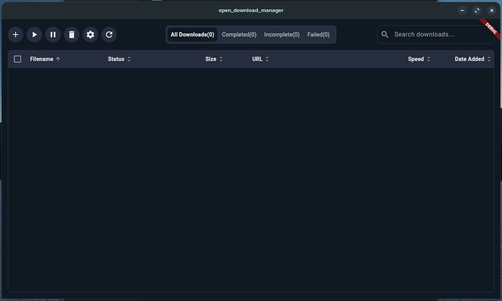
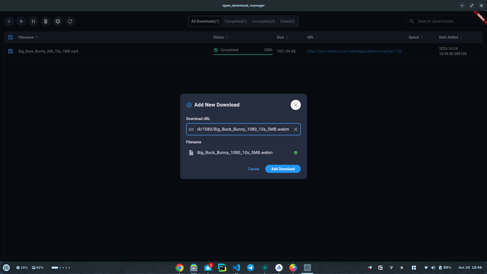
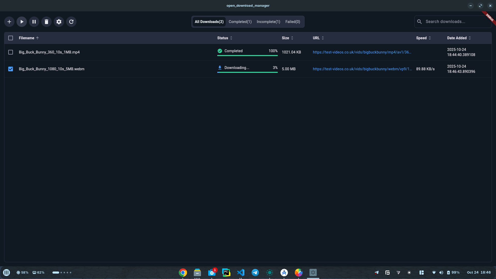

````markdown
# Open Download Manager

Open Download Manager is a free and open-source download manager built with Flutter, designed to work seamlessly across Android, Windows, iOS, and macOS. It provides a simple, user-friendly interface to manage file downloads with features like pause/resume, progress tracking, and cross-platform compatibility.

## Screenshots

### Main Download Manager Interface

*The main downloads page showing active and completed downloads with progress tracking*

### Add New Download

*Add new downloads by entering a URL - the filename is automatically detected*

### Download Completed

*Completed downloads with status indicators*

## Features

- **Cross-Platform Support**: Runs on Android, iOS, Windows, and macOS with a single codebase.
- **Download Management**: Start, pause, and resume downloads with real-time progress updates.
- **Simple UI**: Intuitive interface for entering URLs and monitoring download status.
- **Open Source**: Released under the MIT License, encouraging community contributions.

## Installation

1. **Prerequisites**:
   - Install [Flutter](https://flutter.dev/docs/get-started/install) (version 3.0 or higher).
   - Ensure you have Dart SDK installed (comes with Flutter).
   - For Android, set up an Android emulator or device.
   - For iOS, configure Xcode (macOS only).
   - For Windows/macOS, enable desktop support with `flutter config --enable-windows-desktop --enable-macos-desktop`.

2. **Clone the Repository**:
   ```bash
   git clone https://github.com/bulaya-ute/open-download-manager.git
   cd open-download-manager
   ```

3. **Install Dependencies**:
   ```bash
   flutter pub get
   ```

4. **Run the App**:
   - For Android/iOS: `flutter run`
   - For Windows: `flutter run -d windows`
   - For macOS: `flutter run -d macos`

## Usage

1. Launch the app on your device or emulator.
2. Enter a valid file URL in the text field (e.g., `https://example.com/sample.pdf`).
3. Click "Start Download" to begin downloading.
4. Monitor progress in the list below, where you can pause or resume downloads.
5. Files are saved to the app's documents directory (accessible via platform-specific file explorers).

## Pending Improvements

This section tracks planned enhancements and optimizations for future releases:

### Performance Optimizations
- **Lazy-load PartialDownloadFile objects**: Currently, all `PartialDownloadFile` objects are loaded into memory when the app starts. For better performance with large download lists, implement on-demand loading where `PartialDownloadFile` objects are only loaded for:
  - Active/downloading items
  - Items visible in the viewport
  - Items being interacted with by the user
  
  This will significantly reduce memory usage and improve startup time for users with hundreds or thousands of download history items.

### Future Features
- (Add more items here as needed)

## Contributing

We welcome contributions! To contribute:

1. Fork the repository.
2. Create a feature branch (`git checkout -b feature/YourFeature`).
3. Commit your changes (`git commit -m 'Add YourFeature'`).
4. Push to the branch (`git push origin feature/YourFeature`).
5. Open a Pull Request.

## License

This project is licensed under the MIT License - see the [LICENSE](LICENSE) file for details.

## Acknowledgments

- Built with [Flutter](https://flutter.dev/) for cross-platform development.
- Thanks to the open-source community for inspiration and support.
